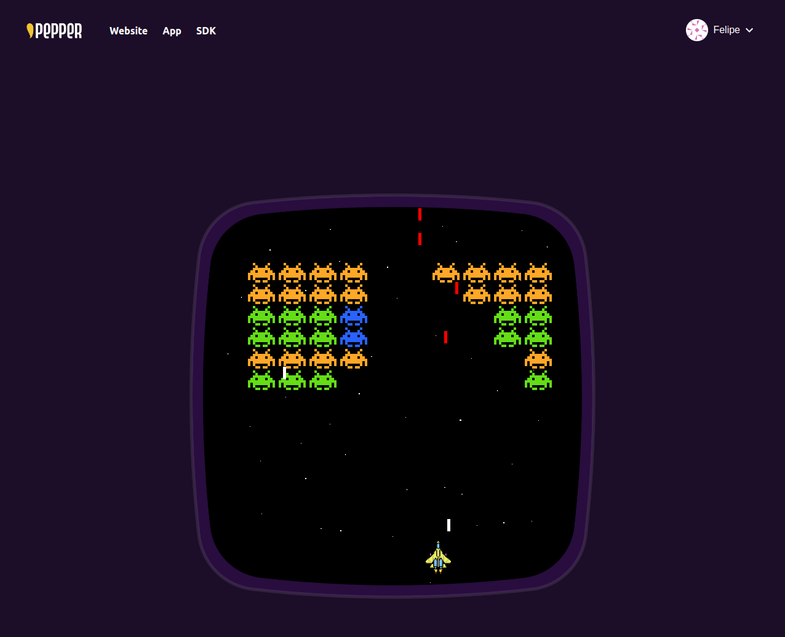

# Pepper Star Battle

## Demo game featuring [Peppergaming Auth SDK](https://github.com/peppergaming/auth).



This project shows how our [Auth SDK](https://github.com/peppergaming/auth)
can be integrated in a game, allowing an easy web3 integration.

The game codebase is inspired by [this project](https://github.com/CodingWith-Adam/space-invaders).

You can try the demo [here](https://demo.peppergaming.com/)!

Users can login and have access to a web3 profile. After the first win it is possible to claim an NFT ship from
our [demo collection](https://testnets.opensea.io/assets/rinkeby/0x90a96fca895860a945515c39d5945e854f17e95f/) and use
them in the game.

### Peppergaming sdk integration

The authentication powered by Peppergaming, can be found in the [auth service](src/services/auth/index.tsx)
. This is a typical implementation of authentication, by using [react's context](https://reactjs.org/docs/context.html)
infrastructure.

In this project we initialized the peppergaming sdk with the following code:

```typescript
    const eventSubscriber: EventSubscriber = {
  async onConnected(
    userInfo: UserInfo,
    provider: Provider,
    signer: PepperWallet
  ) {
    setUserInfo(userInfo);
    setIsPepperLogged(true);
    setProvider(provider);
    setSigner(signer);
    setIsLoading(false);
    console.debug("Connected");
  },
  async onConnecting() {
    console.debug("Connecting");
  },
  async onAuthChallengeSigning() {
    console.debug("AuthChallengeSingning");
  },
  async onDisconnected() {
    console.debug("Disconnected");
  },
  async onErrored(error: any) {
    console.error("Error from pepper sdk: ", error);
    await pepperSdk?.logout();
  },
};

let options: PepperLoginOptions = {
  chainConfig: {
    chainId: 4,
    name: "Ankr Rinkeby RPC",
    rpcTarget: CHAIN_RPC_URL,
  },
  isDevelopment: isDev,
  isMobile: isMobile,
  logLevel: isDev ? "debug" : "info",
  eventSubscriber,
};

const pepperSdk = new PepperLogin(options);

await pepperSdk.init();
```

In this case we passed also the chainConfig option, that allows to obtain
a [web3 Provider](https://docs.ethers.io/v5/api/providers/provider/) ready to use after login.
The usage of this Provider can be found in the [game service](src/services/game/index.tsx).

For more information about how to get started with our sdk please visit https://github.com/peppergaming/auth .

### Local Development

If you want to run the application in your local node environment you will need node 16+.

Just clone or download this repo and install the dependencies:

```shell
npm i
```

Then launch the application:

```shell
npm run dev
```